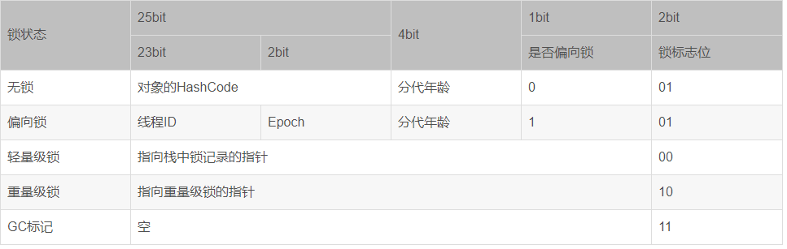

Java对象保存在内存中时，由以下三部分组成：

```
1，对象头

2，实例数据

3，对齐填充字节
```

[toc]

### 一，对象头

`java`的对象头由以下三部分组成：

```
1，Mark Word

2，指向类的指针

3，数组长度（只有数组对象才有）
```

#### **1，Mark Word**

​		Mark Word记录了对象和锁有关的信息，当这个对象被synchronized关键字当成同步锁时，围绕这个锁的一系列操作都和Mark Word有关。

Mark Word在32位JVM中的长度是32bit，在64位JVM中长度是64bit。

Mark Word在不同的锁状态下存储的内容不同，在32位JVM中是这么存的：



其中无锁和偏向锁的锁标志位都是01，只是在前面的1bit区分了这是无锁状态还是偏向锁状态。

JDK1.6以后的版本在处理同步锁时存在锁升级的概念，JVM对于同步锁的处理是从偏向锁开始的，随着竞争越来越激烈，处理方式从偏向锁升级到轻量级锁，最终升级到重量级锁。

 

JVM一般是这样使用锁和Mark Word的：

1，当没有被当成锁时，这就是一个普通的对象，Mark Word记录对象的HashCode，锁标志位是01，是否偏向锁那一位是0。

2，当对象被当做同步锁并有一个线程A抢到了锁时，锁标志位还是01，但是否偏向锁那一位改成1，前23bit记录抢到锁的线程id，表示进入偏向锁状态。

3，当线程A再次试图来获得锁时，JVM发现同步锁对象的标志位是01，是否偏向锁是1，也就是偏向状态，Mark Word中记录的线程id就是线程A自己的id，表示线程A已经获得了这个偏向锁，可以执行同步锁的代码。

4，当线程B试图获得这个锁时，JVM发现同步锁处于偏向状态，但是Mark Word中的线程id记录的不是B，那么线程B会先用CAS操作试图获得锁，这里的获得锁操作是有可能成功的，因为线程A一般不会自动释放偏向锁。如果抢锁成功，就把Mark Word里的线程id改为线程B的id，代表线程B获得了这个偏向锁，可以执行同步锁代码。如果抢锁失败，则继续执行步骤5。

5，偏向锁状态抢锁失败，代表当前锁有一定的竞争，偏向锁将升级为轻量级锁。JVM会在当前线程的线程栈中开辟一块单独的空间，里面保存指向对象锁Mark Word的指针，同时在对象锁Mark Word中保存指向这片空间的指针。上述两个保存操作都是CAS操作，如果保存成功，代表线程抢到了同步锁，就把Mark Word中的锁标志位改成00，可以执行同步锁代码。如果保存失败，表示抢锁失败，竞争太激烈，继续执行步骤6。

6，轻量级锁抢锁失败，JVM会使用自旋锁，自旋锁不是一个锁状态，只是代表不断的重试，尝试抢锁。从JDK1.7开始，自旋锁默认启用，自旋次数由JVM决定。如果抢锁成功则执行同步锁代码，如果失败则继续执行步骤7。

7，自旋锁重试之后如果抢锁依然失败，同步锁会升级至重量级锁，锁标志位改为10。在这个状态下，未抢到锁的线程都会被阻塞。

 

#### **2，指向类的指针**

该指针在32位JVM中的长度是32bit，在64位JVM中长度是64bit。

Java对象的类数据保存在方法区。

 

#### **3，数组长度**

只有数组对象保存了这部分数据。

该数据在32位和64位JVM中长度都是32bit。

 

### 二，实例数据

对象的实例数据就是在java代码中能看到的属性和他们的值。

 

### 三，对齐填充字节

因为JVM要求java的对象占的内存大小应该是8bit的倍数，所以后面有几个字节用于把对象的大小补齐至8bit的倍数，没有特别的功能。