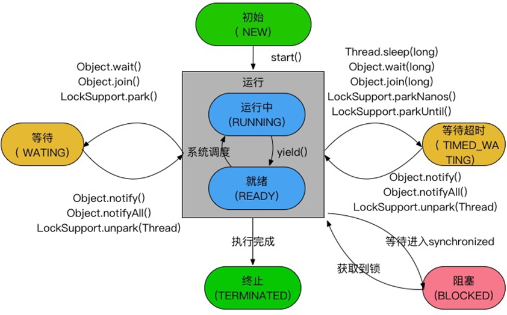

[toc]

### 1.Java 程序天生就是多线程的

一个 Java 程序从 main()方法开始执行，然后按照既定的代码逻辑执行，看 似没有其他线程参与，但实际上 Java 程序天生就是多线程程序，因为执行 main() 方法的是一个名称为 main 的线程。

```java
public class Main {

    public static void main(String[] args) {
        //Java虚拟机线程系统的管理接口
        ThreadMXBean threadMXBean = ManagementFactory.getThreadMXBean();
        //不需要获取同步的monitor和synchronizer信息，仅获取线程和线程堆栈信息
        ThreadInfo[] threadInfos = threadMXBean.dumpAllThreads(false, false);
        for (ThreadInfo info : threadInfos) {
            System.out.println(String.format("[%s]-%s", info.getThreadId(), info.getThreadName()));
        }
    }
}
//[6]-Monitor Ctrl-Break    监控 Ctrl-Break 中断信号的
//[5]-Attach Listener       内存 dump，线程 dump，类信息统计，获取系统属性等
//[4]-Signal Dispatcher     分发处理发送给 JVM 信号的线程
//[3]-Finalizer             Finalizer // 调用对象 finalize 方法的线程
//[2]-Reference Handler     清除 Reference 的线程
//[1]-main                  main 线程，用户程序入口

```

### 2.线程的启动与中止

- 启动线程的方式有两种：
  - `X extends Thread`，然后 X.start
  - `X implements Runnable`然后交给 Thread 运行

- Thread 和 Runnable 的区别

  **Thread 才是 Java 里对线程的唯一抽象，Runnable 只是对任务（业务逻辑） 的抽象。Thread 可以接受任意一个 Runnable 的实例并执行。**

- 中止  

  - ~~`stop（）`~~ 暴力停止，不建议使用

  - `interrupt()`中止标志位  

    ```java
    public class Main {
    
        static class EndThread extends Thread {
            @Override
            public void run() {
                while (!isInterrupted()) {
                    try {
                        Thread.sleep(100);
                    } catch (InterruptedException e) {
                        //做资源释放工作后再中断线程
                        System.out.println("释放资源");
                        interrupt();
                        e.printStackTrace();
                    }
                    System.out.println("EndThread is running");
                }
                System.out.println("interrupted flag = " + isInterrupted());
            }
        }
    
        public static void main(String[] args) throws InterruptedException {
            EndThread endThread = new EndThread();
            endThread.start();
            Thread.sleep(500);
            endThread.interrupt();
    
        }
    }
    ```

  如果一个线程处于了阻塞状态（如线程调用了 thread.sleep、thread.join、 thread.wait 等），则在线程在检查中断标示时如果发现中断标示为 true，则会在 这些阻塞方法调用处抛出 InterruptedException 异常，并且在抛出异常后会立即 将线程的中断标示位清除，即重新设置为 false。

  ​			不建议自定义一个取消标志位来中止线程的运行。因为 run 方法里有阻塞调 用时会无法很快检测到取消标志，线程必须从阻塞调用返回后，才会检查这个取 消标志。这种情况下，使用中断会更好，因为， 一、一般的阻塞方法，如 sleep 等本身就支持中断的检查， 二、检查中断位的状态和检查取消标志位没什么区别，用中断位的状态还可 以避免声明取消标志位，减少资源的消耗。

  ​		**注意：处于死锁状态的线程无法被中断**

- 线程中`sleep()`,`wait()`,`join()`,`yield()`

  - `sleep()`方法：**线程让出CPU占有权，时间是指定的。不会释放锁资源**
- `yield()`方法：**使当前线程让出 CPU 占有权，但让出的时间是不可设定的。也 不会释放锁资源。**  
    		注意：并不是每个线程都需要这个锁的，而且执行 yield( )的线 程不一定就会持有锁，我们完全可以在释放锁后再调用 yield 方法。 所有执行 yield()的线程有可能在进入到就绪状态后会被操作系统再次选中 马上又被执行。
  - `join()`方法：**把指定的线程加入到当前线程，可以将两个交替执行的线程合并为顺序执行。**  
       比如在线程 B 中调用了线程 A 的 Join()方法，直到线程 A 执行完毕后，才会继续 执行线程 B。
  - `wait()`方法：**睡眠等待，同时释放锁，直到notify、notifyAll唤醒**
  - `notify()、notifyAl()`：唤醒`wait()`等待
  - `setDaemon(true)`:设置守护线程。  
    Daemon（守护）线程是一种支持型线程，因为它主要被用作程序中后台调 度以及支持性工作。这意味着，当一个 Java 虚拟机中不存在非 Daemon 线程的 时候，Java 虚拟机将会退出。可以通过调用 `Thread.setDaemon(true)`将线程设置 为 Daemon 线程。我们一般用不上，比如垃圾回收线程就是 Daemon 线程。

### 3.线程的生命周期

1.  初始(NEW)：新创建了一个线程对象，但还没有调用start()方法。
2. 运行(RUNNABLE)：Java线程中将就绪（ready）和运行中（running）两种状态笼统的称为“运行”。
线程对象创建后，其他线程(比如main线程）调用了该对象的start()方法。该状态的线程位于可运行线程池中，等待被线程调度选中，获取CPU的使用权，此时处于就绪状态（ready）。就绪状态的线程在获得CPU时间片后变为运行中状态（running）。
3. 阻塞(BLOCKED)：表示线程阻塞于锁。
4. 等待(WAITING)：进入该状态的线程需要等待其他线程做出一些特定动作（通知或中断）。1
5. 超时等待(TIMED_WAITING)：该状态不同于WAITING，它可以在指定的时间后自行返回。
6. 终止(TERMINATED)：表示该线程已经执行完毕



### 4.线程间的共享

- `synchronized` 内置锁

  Java 支持多个线程同时访问一个对象或者对象的成员变量，关键字 synchronized 可以修饰方法或者以同步块的形式来进行使用，它主要确保多个线 程在同一个时刻，只能有一个线程处于方法或者同步块中，它保证了线程对变量 访问的可见性和排他性，又称为内置锁机制。

- `volatile`关键字，最轻量的同步机制,只能保证可见性，不能包证原子性
- ThreadLocal
- 等待和通知，`awit()`,`notify()/notifyAll()`