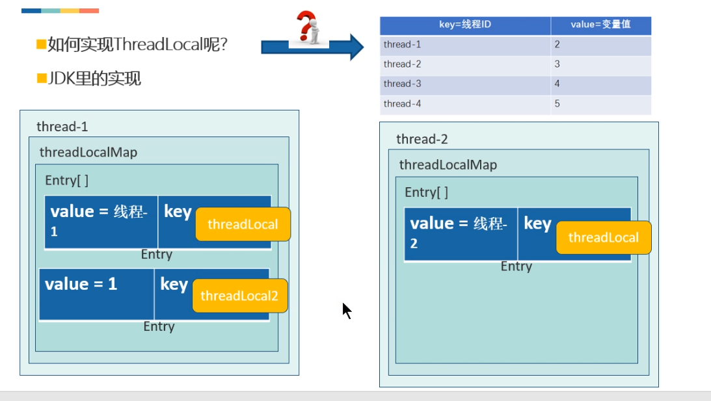

[toc]

### `ThreadLocal`

**线程本地变量，也有些地方叫做线程本地存储，其实意思差不多。ThreadLocal可以让每个线程拥有一个属于自己的变量的副本，不会和其他线程的变量副本冲突，实现了线程的数据隔离。**

## 死锁的三个条件

1. 多个操作者（M>=2）争夺多个资源（N>=2）,并且N<=M；
2. 争夺资源的顺序不对；
3. 拿到资源不放手。

- 学术化的规范定义

1. 互斥条件
2. 请求保持
3. 不剥夺
4. 环路等待

### `CAS`(Compare And Swap)

- 原子操作
  - 锁操作就是一种重量级的原子操作（悲观锁）
- `CAS`的原理（乐观锁）

1. 利用了现代处理器都支持的`cas`指令
2. **循环**这个指令，知道成功为止

- `CAS`的问题

1. ABA问题,使用版本戳解决`AtomicMarkableReference`
2. 开销问题：自选长期不成功，导致开销过大问题，应改用加锁
3. 只能保证一个共享变量的原子操作，将多个共享变量打包到一个对象中或者使用`synchronized`

- JDK中的原子操作类
  1. 基本类型：`AtomicBoolean`，`AtomicInteger`，`AtomicLong`
  2. 数组类：`AtomicIntegerArray`，`AtomicLongArray`，`AtomicReferenceArray`
  3. 引用类型：`AtomicReference`，`AtomicMarkableReference`，`AtomicStampedReference`

