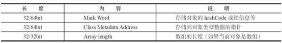
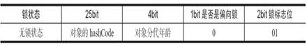
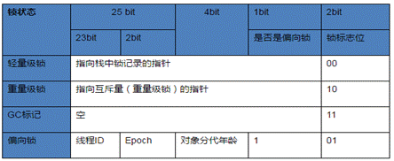

[toc]

### 1.volatile详解

1. volatile特性

   ​	可以把对volatile变量的单个读/写，看成是使用同一个锁对这些单个读/写操作做了同步

   -  可见性。对一个volatile变量的读，总是能看到（任意线程）对这个volatile变量最后的写入。
   - 原子性：对任意单个volatile变量的读/写具有原子性，但类似于volatile++这种复合操作不具有原子性。

2. volatile的实现原理

   ​			通过对OpenJDK中的unsafe.cpp源码的分析，会发现被volatile关键字修饰的变量会存在一个“lock:”的前缀。
   Lock前缀，Lock不是一种内存屏障，但是它能完成类似内存屏障的功能。Lock会对CPU总线和高速缓存加锁，可以理解为CPU指令级的一种锁。
   ​			同时该指令会将当前处理器缓存行的数据直接写会到系统内存中，且这个写回内存的操作会使在其他CPU里缓存了该地址的数据无效。

### 2.synchronized的实现原理

​			`Synchronized`在JVM里的实现都是基于进入和退出Monitor对象来实现方法同步和代码块同步，虽然具体实现细节不一样，但是都可以通过成对的`MonitorEnter`和`MonitorExit`指令来实现。

​			对同步块，`MonitorEnter`指令插入在同步代码块的开始位置，当代码执行到该指令时，将会尝试获取该对象Monitor的所有权，即尝试获得该对象的锁，而`monitorExit`指令则插入在方法结束处和异常处，JVM保证每个`MonitorEnter`必须有对应的`MonitorExit`。

​			对同步方法，从同步方法反编译的结果来看，方法的同步并没有通过指令`monitorenter`和`monitorexit`来实现，相对于普通方法，其常量池中多了`ACC_SYNCHRONIZED`标示符。

​			JVM就是根据该标示符来实现方法的同步的：当方法被调用时，调用指令将会检查方法的 `ACC_SYNCHRONIZED` 访问标志是否被设置，如果设置了，执行线程将先获取`monitor`，获取成功之后才能执行方法体，方法执行完后再释放`monitor`。在方法执行期间，其他任何线程都无法再获得同一个`monitor`对象。

​		`synchronized`使用的锁是存放在Java对象头里面，

​		具体位置是对象头里面的`MarkWord`，`MarkWord`里默认数据是存储对象的`HashCode`等信息，

但是会随着对象的运行改变而发生变化，不同的锁状态对应着不同的记录存储方式

