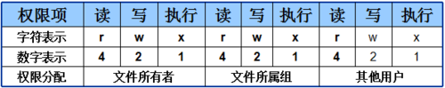

[toc]

### 一、终端

是输入输出设备的总称，内部是一个命令解析器，内嵌shell解析器。

```
Windows：SSH，XShell
Mac：自带终端
```

### 二、Linux常用快捷键

```
Tab 补齐
Ctrl + A 【移动光标到最前面】
Ctrl + A 【移动光标到最后面】
Ctrl + U 【光标清楚】
Ctrl + S 【是停止字符输出的终端控制字符】
Ctrl + Q 【组合键重新启用终端输出】
Ctrl + C 【中断命令或进程该按的键。它将立刻终止运行的程序】
Ctrl + L 【清空屏幕，代替clear命令】
上、下键 【切换之前输入的命令】
```

### 三、Linux文件操作

```shell
cd dirName 【进入目录】
cd .. 【返回上一级目录】
cd . 【就是在当前目录 相当于啥事都没有做了】
cd 【回到根目录】
pwd 【查看当前路径】
ls 【大概目录】
ls -all 【详细目录】
ls -lh 【xxKB,详细目录】
clear 【清除屏幕】
date 【服务器的时间】
mkdir NDK24 【创建文件夹】
touch file01.txt 【创建文件】 
ls -all 【查看全部】
ls -R 【查看 目录、文件夹 里面的详情】
rm -rf file.txt 【删除文件】
rm New02/ 【没法递归遍历删除】
rm -rf New02/ 【递归遍历删除】
cp f.txt New/ 【copy f文件 New文件夹】 
mv f.txt f2.txt 【重命名】
```

### 四、Linux文件权限

```shell
-rw-r--r-- 1 root root
```

- 第1位 文件类型

```
- 【普通文件】
d 【目录】
l 【软链接(Win快捷方式】
c 【字符设备文件】
b 【块设备文件】
p 【管道 Binder通信为什么比管道性能高?】 
s 【套接字】
```

- 第2-10位	

```

- 数字限定发:777 【4可读 2可写 1可执行】 = 7

```shell
chmod 777 file.txt 【可读可写可执行，可读可写可执行，可读可写可执行】 
-rwxrwxrwx 1 root root 0 Apr 25 21:44 file.txt

chmod 111 file.txt 【可执行，可执行，可执行】
--x--x--x 1 root root 0 Apr 25 21:44 file.txt

chmod 412 file0.txt 【可读，可执行，可写】
-r----x-w- 1 root root 0 Apr 25 21:44 file0.txt

chomd 333 file0.txt 【可写可执行，可写可执行，可写可执行】
--wx-wx-wx 1 root root 0 Apr 25 21:44 file.txt
```

- 字母限定发:  w写 r读 x可执行 

```shell
chmod 000 file.txt 【取出所有权限】

chmod +x file.txt 【默认三组 可执行】
---x--x--x 1 root root 0 Apr 25 21:44 file.txt

chmod +r file.txt 【默认三组 可读】 
-r--r--r-- 1 root root 0 Apr 25 21:44 file.txt

chmod +w file.txt 【第一组 可写】
--w------- 1 root root 0 Apr 25 21:44 file.txt
```

- 组权限

```shell
u user(第一组)
g group(第二组)
o other(第三组)
a all (所有组)
chmod u+rwx file.txt	【专门给第一组 加入 可读可写可执行】
-rwx------ 1 root root 0 Apr 25 21:44 file.txt

chmod g+rwx file.txt	【专门给第二组 加入 可读可写可执行】
----rwx--- 1 root root 0 Apr 25 21:44 file.txt

chmod o+rwx file.txt 【专门给第三组 加入 可读可写可执行】 
-------rwx 1 root root 0 Apr 25 21:44 file.txt

chmod a+rwx file.txt 【三组全部 ，可读可写可执行，相当于 777】 
-rwxrwxrwx 1 root root 0 Apr 25 21:44 file.txt
```

### 五、命令执行原理

```
date -----> Shell命令解析器 解析到 date后 ./date 执行 /bin目录下的 date文件
```

### 六、文件读取

```shell
临时环境变量:关闭窗口后就消失
export AAAA=1234567
echo $AAAA

全局环境变量:一直存在系统中
vim /etc/profile 加入 export BBBB="9876543" 
source profile 【修改的生效】
echo $derry
```

### 七、Linux中的用户与用户组

```shell
# 【代表root权限】
xxx$ 【代表普通权限】
```

- 切换root权限

```
sudo su root 【切换到root】
	再输入密码按回车，进入root权限
exit	【退出root权限】
```

- 创建用户与用户组

```shell
sudo adduser user_01--force-badname
sudo adduser user_01 【添加一个用户 user_01】
sudo chown user_01 file03.txt 【把file03文件所属用户修改成 user_01】 
sudo chgrp group_01 file03.txt 【把file03文件所属组修改成 group_01】
```


