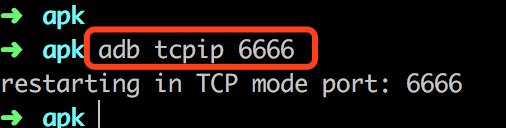

1. 手机和电脑连接同一局域网（连同一个 WiFi）

2. 在手机的设置、网络连接查看连接的 WiFi 下手机的 IP 地址

3. 手机连上电脑，输入命令：adb tcpip <端口号>，<端口号> 可任意取，只要没被占用，如 6666	

    

4. 拔掉数据线输入命令：adb connect <手机IP地址>:<端口号> ，输出 connected to <手机IP地址> 即为连接成功，如下输入：adb connect 10.3.1.128:6666，10.3.1.128 是手机IP地址

    

5. 可以查看下连接的设备，命令：adb devices

    

6. 可以正常调试了，Run app 或看 Log ,跟连数据线一样，而且不受线的限制了

7. 断开连接，命令：adb disconnect <手机IP地址>:<端口号>，如：adb disconnect 10.3.1.128:6666

    

注意事项：

- 手机需要开启 USB 调试
- 手机和电脑要在同一个局域网（连接同一个 WiFi）
- adb connect 连接成功后要拔出 USB 线，不然出现同时连接两个设备的问题
- 执行命令 ”adb tcpip 6666“ 后可能需要重新开启 USB 调试
  