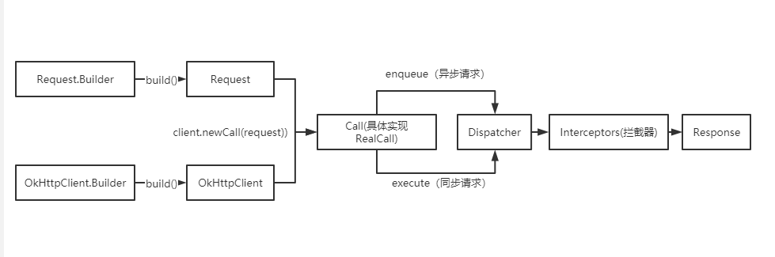

[toc]

### 1.okhttp介绍

OkHttp是当下Android使用最频繁的网络请求框架，由Square公司开源。Google在Android4.4以后开始将源码中 的HttpURLConnection底层实现替换为OKHttp，同时现在流行的Retrofit框架底层同样是使用OKHttp的。

优点：

- 支持http、http2.0,WebSocket，并允许对同一主机的所有请求共享一个套接字
- 通过连接池(Socket连接复用池)，减少了请求延迟（减少三次握手）
- 默认通过GZip压缩数据
- 响应缓存，避免了重复请求网络
- 请求失败时自动重试主机的其他IP，自动重定向

### 2.调用流程

OkHttp请求过程中最少只需要接触OkHttpClient、Request、Call、Response，但是框架内部进行了大量逻辑处理。所有的逻辑大部分集中在拦截器中，但是进入拦截器之前还需要依靠分发器来调配请求任务。

- 分发器：内部维护队列与线程池，完成请求调配
- 拦截器：五大默认拦截器完成请求过程



#### 1.OkHttpClient 中全是一些配置，比如代理的配置、ssl证书的配置等。

#### 2.Request是请求参数的配置

#### 3.Call 本身是一个接口，我们获得的实现 为: RealCall

**Call 的 execute 代表了同步请求，而 enqueue 则代表异步请求。两者唯一区别在于一个会直接发起网络请求，而
另一个使用OkHttp内置的线程池来进行。**

```java
//RealCall.java
static RealCall newRealCall(OkHttpClient client, Request originalRequest, boolean forWebSocket){
	// Safely publish the Call instance to the EventListener.
	RealCall call = new RealCall(client, originalRequest, forWebSocket);
	call.eventListener = client.eventListenerFactory().create(call);
	return call;
}

```

##### (1)同步请求,最后调用了<span style='color:red'>`getResponseWithInterceptorChain()`</span>方法获取Response

```java
//RealCall.java
@Override 
public Response execute() throws IOException {
	synchronized (this) {
		if (executed) throw new IllegalStateException("Already Executed");
		executed = true;
	}
	captureCallStackTrace();
	eventListener.callStart(this);
	try {
		//调用分发器
		client.dispatcher().executed(this);
		//执行请求
		Response result = getResponseWithInterceptorChain();
		if (result == null) throw new IOException("Canceled");
		return result;
	} catch (IOException e) {
		eventListener.callFailed(this, e);
		throw e;
	} finally {
		//请求完成
		client.dispatcher().finished(this);
	}
}
```

##### (2)异步请求，最调用了Dispatcher的`enqueue()`方法

```java
//RealCall.java
@Override
public void enqueue(Callback responseCallback) {
    synchronized (this) {
        if (executed) throw new IllegalStateException("Already Executed");
        executed = true;
    }
    captureCallStackTrace();
    eventListener.callStart(this);
    client.dispatcher().enqueue(new AsyncCall(responseCallback));
}
```

#### 4.Dispatcher ，分发器就是来调配请求任务的，内部会包含一个线程池。

##### (1)可以在创建 OkHttpClient 时，传递我们自己定义的线程池来创建分发器。

```java
//异步请求同时存在的最大请求
private int maxRequests = 64;
//异步请求同一域名同时存在的最大请求
private int maxRequestsPerHost = 5;
//闲置任务(没有请求时可执行一些任务，由使用者设置)
private @Nullable Runnable idleCallback;
//异步请求使用的线程池
private @Nullable ExecutorService executorService;
//异步请求等待执行队列
private final Deque<AsyncCall> readyAsyncCalls = new ArrayDeque<>();
//异步请求正在执行队列
private final Deque<AsyncCall> runningAsyncCalls = new ArrayDeque<>();
//同步请求正在执行队列
private final Deque<RealCall> runningSyncCalls = new ArrayDeque<>();

```

##### (2)异步任务进入分发器,会调用线程池执行任务

```java
//Dispatcher.java
synchronized void enqueue(AsyncCall call) {
    // 1、如果正在执行的请求小于64
    // 2、相同host的请求不能超过5个
    if (runningAsyncCalls.size() < maxRequests && runningCallsForHost(call) < maxRequestsPerHost) {
        runningAsyncCalls.add(call);  //正在执行的请求
        executorService().execute(call); //线程池跑任务
    } else {
        readyAsyncCalls.add(call);
    }
}
```

##### (3)异步任务被封装为`AsyncCall`，是一个runnable，它的run方法执行了execute（）,最后调用了<span style='color:red'>`getResponseWithInterceptorChain()`</span>方法获取Response

```java
@Override
public Response execute() throws IOException {
    synchronized (this) {
        if (executed) throw new IllegalStateException("Already Executed");
        executed = true;
    }
    captureCallStackTrace();
    eventListener.callStart(this);
    try {
        client.dispatcher().executed(this);
        // 发起请求
        Response result = getResponseWithInterceptorChain();
        if (result == null) throw new IOException("Canceled");
        return result;
    } catch (IOException e) {
        eventListener.callFailed(this, e);
        throw e;
    } finally {
        client.dispatcher().finished(this);
    }
}
```

##### (4)如果加入等待队列后，就需要等待有空闲名额才开始执行。因此每次执行完 一个请求后，都会调用分发器的 finished 方法

```java
//异步请求调用
void finished(AsyncCall call) {
	finished(runningAsyncCalls, call, true);
}
//同步请求调用
void finished(RealCall call) {
	finished(runningSyncCalls, call, false);
}
private <T> void finished(Deque<T> calls, T call, boolean promoteCalls) {
	int runningCallsCount;
	Runnable idleCallback;
	synchronized (this) {
		//不管异步还是同步，执行完后都要从队列移除(runningSyncCalls/runningAsyncCalls)
		if (!calls.remove(call)) throw new AssertionError("Call wasn't in-flight!");
		if (promoteCalls) promoteCalls();
		//异步任务和同步任务正在执行的和
		runningCallsCount = runningCallsCount();
		idleCallback = this.idleCallback;
	}
	// 没有任务执行执行闲置任务
	if (runningCallsCount == 0 && idleCallback != null) {
		idleCallback.run();
	}
}
```

##### (5)任务完成后重新调配请求

**需要注意的是 只有异步任务才会存在限制与等待，所以在执行完了移除正在执行队列中的元素后，异步任务结束会 执行 promoteCalls() 。很显然这个方法肯定会重新调配请求。**

```java
/**
 * 从ready获取任务放入running执行
 */
private void promoteCalls() {
    if (runningAsyncCalls.size() >= maxRequests) return; // Already running max capacity.
    if (readyAsyncCalls.isEmpty()) return; // No ready calls to promote.
	for (Iterator<AsyncCall> i = readyAsyncCalls.iterator(); i.hasNext(); ) {
        AsyncCall call = i.next();
        // 同一Host请求只能同时有5个
        if (runningCallsForHost(call) < maxRequestsPerHost) {
            i.remove();
            runningAsyncCalls.add(call);
            executorService().execute(call);
        }
		if (runningAsyncCalls.size() >= maxRequests) return; // Reached max capacity.
    }
}
```

